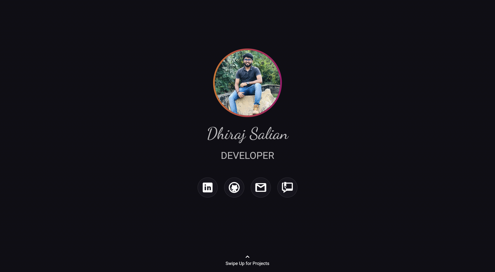

# Portfolio

A static portfolio application for showcasing projects. It is built using flutter framework.

## How to use

1. Clone the project.
2. Update the assets.
3. Run `flutter build web`.
4. The application will be built in `build/web` directory.

## Demo

You can access the live website at [dhirajsalian.com](https://dhirajsalian.com)

## Contributing

If you would like to contribute, feel free to create a pull request with your changes/fixes.
